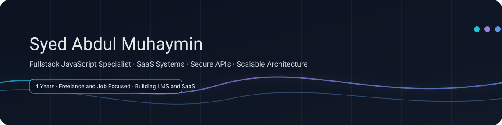

  

  
  
  
  

  Fullstack developer building modern SaaS and web apps with secure backend systems and clean frontend UI.

---

## About

I’m Syed Abdul Muhaymin, a Fullstack JavaScript specialist with 4 years of experience building production-ready web systems.

I work across freelance and professional environments and I care about:
- clean architecture and predictable codebases  
- secure auth and practical security defaults  
- fast, maintainable UI with modern frontend patterns  
- shipping reliably with clear scope and updates  

---

## What I Build

- SaaS dashboards and admin panels  
- Secure REST APIs and backend services  
- Role-based systems (multi-user and multi-tenant patterns)  
- CMS-style modules (content models, workflows, moderation)  
- Automation pipelines and scraping systems when needed  
- AI-integrated features for real product workflows  

---

## Core Stack

### Frontend

### Backend

### Security and Reliability

### Dev Tools

### Additional Experience

---

## Featured Work

### Fullstack SaaS Platform
A modern web app built with React, TypeScript, Node/Express and PostgreSQL.

What I typically deliver in these systems:
- role-based access and protected routes  
- secure authentication patterns  
- clean schema design and migrations  
- admin dashboards and analytics-ready structure  
- production-ready APIs with clear error contracts  

### CMS Style Web Apps
Modular content-driven systems with:
- structured content models  
- moderation and workflows  
- role-aware dashboards  
- scalable API design  

### Automation and Data Pipelines
For projects that need scraping or updates at scale:
- concurrency-first scraping patterns  
- queue-based workflows  
- change detection and notifications  

---

## GitHub Snapshot

  

## Work With Me

I’m open to:
- full-time roles  
- high-quality freelance work  
- SaaS and web app builds  
- backend-heavy architecture work  

LinkedIn: https://www.linkedin.com/in/syed-muhaymin/

  <b>Modern SaaS. Secure APIs. Clean UI. Reliable Delivery.</b>

